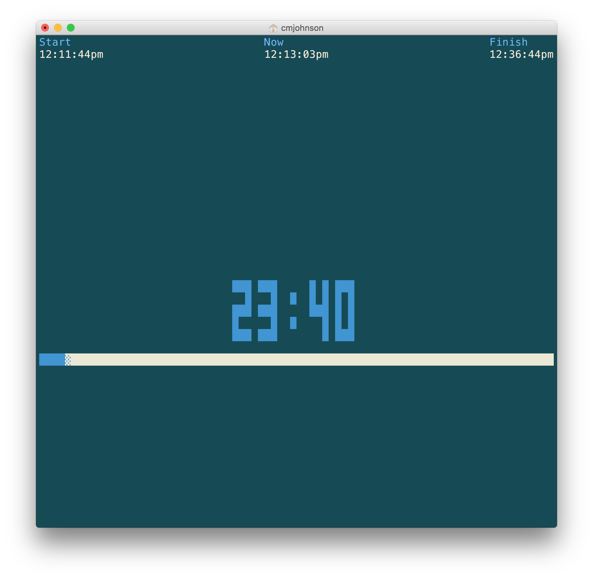

# pomodoro
Command line [pomodoro timer](https://en.wikipedia.org/wiki/Pomodoro_Technique), implemented in Go.

## Installation
First install [Go](http://golang.org).

If you just want to install the binary to your current directory and don't care about the source code, run

```bash
GOBIN="$(pwd)" GOPATH="$(mktemp -d)" go get github.com/carlmjohnson/pomodoro
```

## Usage
Usage of pomodoro:

    pomodoro [options] [duration]

Duration defaults to 25 minutes. Durations may be expressed as integer minutes
(e.g. "15") or time with units (e.g. "1m30s" or "90s").

Chimes system bell at the end of the timer, unless -silence is set.

## Screenshots
```bash
$ pomodoro -simple
Start timer for 25m0s.

Countdown: 24:43

$ pomodoro -h
Usage of pomodoro:

    pomodoro [options] [duration]

Duration defaults to 25 minutes. Durations may be expressed as integer minutes
(e.g. "15") or time with units (e.g. "1m30s" or "90s").

Chimes system bell at the end of the timer, unless -silence is set.
  -silence
        Don't ring bell after countdown
  -simple
        Display simple countdown
```



## Recommended helper
[Noti](https://github.com/variadico/noti) can be used to bring up a system alert when pomodoro finishes.
